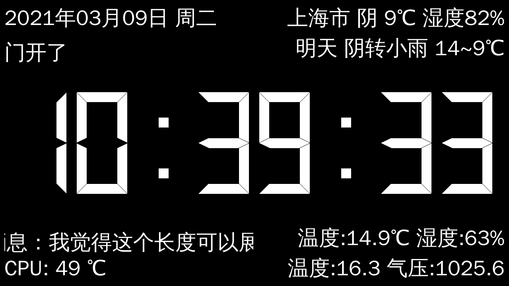
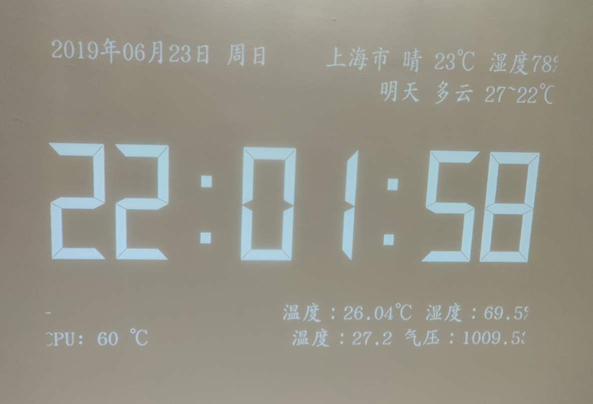

这是一个使用Qt5编写的时钟投影的界面，主要用于时间显示，界面的四个角落也可显示其他的一些信息。





**[Bilibili视频：【树莓派】时间投影](https://www.bilibili.com/video/BV1jE41187Uq)**


## 界面说明：

当前左上角第一行固定显示日期，右上角第一行为当天天气信息，第二行为次日天气信息。信息来源使用高德地图天气API接口获取，需自行申请key并填入配置文件。

左下角第二行主要显示CPU温度，右下角第二行为气压传感器获取的温度气压数据。

其中除了顶部第一行外，其余标签均可通过socket设置自定义信息，但已定义默认信息的会被自动刷新覆盖。

目前左上角第二行和左下角第一行在文字长度超限时会自动滚动显示。


## 支持平台：

当前支持Windows和Linux，在使用Windows时不支持外部传感器，也不支持自动亮度灰度调节，仅作为屏幕信息显示使用。

在Linux平台编译会自动将IIC传感器驱动编译进去，传感器默认在树莓派上使用，在树莓派B+(2014)之后版本均测试通过。

## 传感器：

当前传感器使用IIC进行通讯。

亮度传感器使用BH1750，用于界面显示亮度（灰度）自动调节；

温度气压传感器使用BMP180，用于显示温度和气压。

湿度传感器因不稳定而未使用。


## 配置文件：

首次运行时，将自动在运行目录下生成`led_proj.ini`配置文件，请修改配置文件中的信息以便程序信息正确展示。

### 配置项说明：

#### [serial]

*此处为串口设备配置，此串口主要用于控制投影开关，可不进行配置。*

**BaudRate**：串口波特率

**PortName**：串口设备名或路径（Windows下为类似`COM1`的串口名，Linux下为类似`/dev/ttyUSB0`的设备路径）

#### [socket]

*此处为连接到socket服务器的设置，led_proj将作为客户端连接到服务器，用于数据通讯和控制，如和米家智能联动，设置界面信息显示等。*

**ip**：socket通讯主机地址

**port**：socket通讯主机端口

#### [weather]

*此处为获取高德天气API的信息设置，请先到高德开放平台进行API申请并取得key。*

**apikey**：在高德开放平台申请到的天气查询API key密钥

**city**：要获取的天气信息对应的城市代码，可在[https://developer.amap.com/api/webservice/download](https://developer.amap.com/api/webservice/download) 下载城市编码表查询。


## socket数据：

### 米家联动：

将小米网关（zigbee而非蓝牙网关）发出的json数据直接转发到时间投影即可自动处理，门窗传感器信息默认将在左上角第二行显示，温湿度传感器默认在右下角第一行显示。

### 标签信息设置：

构建一个json数据包，结构如下：

```json
{
    "ledproj": {
        "show1": "info1此处的信息长度超过标签显示时会自动滚动",
        "show2": "此处为天气第二行显示的位置",
        "show3": "此处为自定义信息显示，可显示任意文本信息不会被覆盖，超长会自动滚动",
        "show4": "此处为右下角第一行信息",
        "show5": "此处默认为CPU温度展示位置",
        "show6": "此处为默认气压传感器数据显示位置"
    }
}
```

修改对应标签内的内容并通过socket发送即可在指定位置显示设定的字符。

注意：有定义默认信息显示的位置在一定时间后会被自动刷新覆盖。

